# Punks, The Mini Edition (12×12px)


## What's News? Updates

**NEW!**   Free self-inscribe first-is-first mint (via [bitcoin ordinal inscriptions](https://ordinals.com)) of Punks 12px (10000 max.) started. See [**orc721.github.io/punks12px »**](https://orc721.github.io/punks12px) 


**NEW!**  Free self-inscribe first-is-first mint (via [ethscriptions on ethereum](https://ethscriptions.com) of Punks 12px, The Ethscribe Edition  Vol. 1 - Classic (10000 max.) &
Vol. 2 - Alien Invasion, The Martians (1000 max.)
 See [**0xcompute.github.io/punks12px.vol2 »**](https://0xcompute.github.io/punks12px.vol2) 


**NEW!** D.I.Y. (Create & Download) Punks 12px Builder by [@0xAvocato (SkullCat)](https://twitter.com/0xAvocato/status/1744719873526439992)  Thanks!  See [**illegalmemes.wtf/12pxpunks »**](https://illegalmemes.wtf/12pxpunks)


## Intro

yes, you can - generate your own punk minis in the 12×12px format


[Top](#top) • 
[Ordinal Punks](#ordinal-punks) •
[Orange-Pilled](#orange-pilled) •
[Readymades - The Presidents (of The United States of Amercia)](#readymades---the-presidents-of-the-united-states-of-amercia) •
[Punk Rocks](#punk-rocks)


### Top

let's try the top selling (matt & john's crypto) punks (anno 2017):


``` ruby
require 'pixelart'

require_relative 'base'   ## pull in (local) attributes and generator 

###
# top selling (matt & john's crypo) punks  as of dec/30, 2023
specs = parse_data( <<DATA )
  alien, bandana
  alien, cap forward, pipe, small shades
  alien, headband
  ape, hoodie
  ape, bandana
  ape, cowboy hat
  ape, eye mask, vape, do-rag
  ape, gold chain, knitted cap
  zombie, wild hair, 3d glasses
  ape, knitted cap, small shades
  zombie, chinstrap, earring, crazy hair
  zombie, mohawk thin
DATA

composite  = ImageComposite.new( 4, 3, 
                                  width: 12, height: 12 )

specs.each_with_index do |spec, i|
     img = generate( *spec)
     img.save( "./topmini#{i}.png" )
     img.zoom(10).save( "./topmini#{i}@10x.png" )
     composite << img
end


composite.save( "./topminis.png" )
composite.zoom(4).save( "./topminis@4x.png" )
```

resulting in:


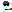


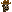


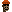
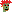


in 10x


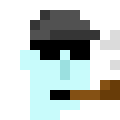

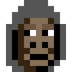
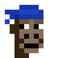
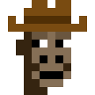

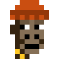

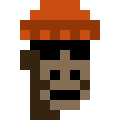


and the fam (all-in-one image composite)

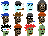

in 4x


### Ordinal Punks

let's try twenty five (sub1k, 100 max.) ordinal punks (anno 2023):

``` ruby
require 'pixelart'

require_relative 'base'   ## pull in (local) attributes and generator 

###
# ordinal (sub1k) punks  
specs = parse_data( <<DATA )
   bot, big beard   #1
   demon, hoodie, pipe  #4
   female3, mole, choker, wild white hair,  big shades, cigarette   #10 
   zombie, mole, 3d glasses, big beard, earring #11  
   orc, beanie, vr, clown nose   # 12
   demon, cigarette, laser eyes  # 17
   alien gold, top hat, silver chain # 21
   blue, clown hair blue  # 22 
   skeleton, eye patch, fedora  #35
   orc female, blonde bob   # 38
   male2, bandana, laser eyes  # 40
   gold, cap forward, laser eyes  #48
   blue female, nerd glasses, blonde short  # 51
   skeleton female, bandana, cigarette #55
   orc female, mole, frumpy hair, green eye shadow  #64
   bot, 3d glasses #69
   alien purple female, pipe, knitted cap  #73
   demon, big beard  #75
   bot, classic shades, cigarette  #76
   zombie, pipe, hoodie, pipe  #78 
   alien green, clown eyes green #84 
   skeleton, clown eyes green   # 86
   bot, crazy hair  # 92
   orc, eye mask, goat, gold chain   # 93
   female3, medical mask, cigarette    # 95
DATA

composite  = ImageComposite.new( 5, 5, 
                                  width: 12, height: 12 )

specs.each_with_index do |spec, i|
     img = generate( *spec)
     img.save( "./sub1kmini#{i}.png" )
     img.zoom(10).save( "./sub1kmini#{i}@10x.png" )
     composite << img
end


composite.save( "./sub1kminis.png" )
composite.zoom(4).save( "./sub1kminis@4x.png" )
```


resulting in:

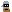
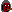
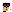

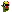

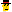
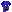

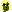


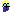

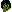


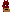

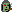
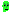


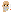


in 10x


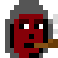


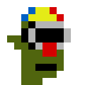
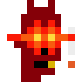

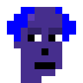


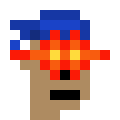


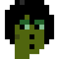

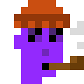
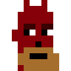

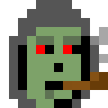


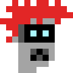
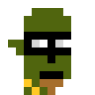


and the fam (all-in-one image composite)


in 4x

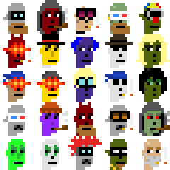


### Orange-Pilled

Is orange the new black? let's try all (bitcoin) orange punks:

``` ruby
require 'pixelart'

require_relative 'base'

###
# orange punks  
specs = parse_data( <<DATA )
   orange
   zombie orange
   ape orange
   alien orange
   demon orange
   orc orange
   skeleton orange
   vampire orange
   mummy orange
   bot orange

   orange,  3d glasses, cap red
   zombie orange, crazy hair
   ape orange, knitted cap, earring, bubble gum
   alien orange, spots, clown nose, clown hair blue
   demon orange, laser eyes, pipe
   orc orange,  eye mask, goat, gold chain 
   skeleton orange, bandana, cigarette
   vampire orange,  purple hair, classic shades
   mummy orange, hoodie
   bot orange, big beard
DATA

composite  = ImageComposite.new( 10, 2, 
                                  width: 12, height: 12 )

specs.each_with_index do |spec, i|
     img = generate( *spec)
     img.save( "./orange#{i}.png" )
     img.zoom(10).save( "./orange#{i}@10x.png" )
     composite << img
end


composite.save( "./oranges.png" )
composite.zoom(4).save( "./oranges@4x.png" )
```


resulting in:

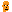
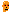


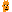


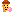
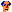
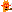

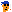
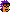
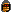


in 10x


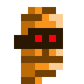
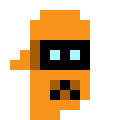

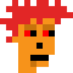
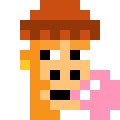
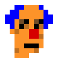


and the fam (all-in-one image composite)


in 4x


### Readymades - The Presidents (of The United States of Amercia)

Let's try readymade characters. Let's start with the presidents (and presidents to be):

``` ruby
require 'pixelart'

require_relative 'base'

###
# the presidents
specs = parse_data( <<DATA )
   joe
   joe (a), cap blue
   joe, clown eyes blue, clown nose 
   joe, 3d glasses
   joe, regular shades
   joe (a), cap blue, regular shades
   joe, laser eyes

   donald
   donald (a), cap red
   donald (a), cap mcd
   donald, clown eyes green, clown nose
   donald, 3d glasses
   donald, laser eyes
   donald, regular shades
 
   nikki
   nikki (a)
   nikki, big shades, earring
   nikki, 3d glasses
   nikki, laser eyes, gold chain
   nikki (a), vr
   nikki (b), hoodie red
DATA

composite  = ImageComposite.new( 7, 3, 
                                  width: 12, height: 12 )

specs.each_with_index do |spec, i|
     img = generate( *spec)
     
     img.save( "./president#{i}.png" )
     img.zoom(10).save( "./president#{i}@10x.png" )
     composite << img
end


composite.save( "./presidents.png" )
composite.zoom(4).save( "./presidents@4x.png" )
```

resulting in:


in 10x


and the fam (all-in-one image composite)


in 4x


### Punk Rocks

Let's rock the punks:

```ruby
require 'pixelart'

require_relative 'base'

###
# punk rocks
specs = parse_data( <<DATA )
   rock gray
   rock gray, peak spike red
   rock gray, top hat 
   rock gray, knitted cap, 3d glasses 
   rock block gray
   rock block gray, 3d glasses 
 
   rock gray, peak spike, laser eyes 
   rock gray, laser eyes 
   rock gold
   rock gold, peak spike, laser eyes 
   rock block gold
   rock block gold, laser eyes 

   rock pink
   rock pink, peak spike blonde, laser eyes blue 
   rock pepe
   rock pepe, peak spike red 
   rock pepe, top hat 
   rock pepe, cap red 
DATA


composite  = ImageComposite.new( 6, 3, 
                                  width: 12, height: 12 )

specs.each_with_index do |spec, i|
     img = generate( *spec)
     
     img.save( "./rock#{i}.png" )
     img.zoom(10).save( "./rock#{i}@10x.png" )
     composite << img
end

composite.save( "./rocks.png" )
composite.zoom(4).save( "./rocks@4x.png" )
```

resulting in:


in 10x


and the fam (all-in-one image composite)


in 4x


## Bonus -  Factory of Modern Originals (FoMO)

Do-it-yourself (DIY) - yes, you can! - fab(criate) your own unique punks in 
12×12px  w/ text attributes (via built-in spritesheets) incl. 2x/4x/8x zoom for bigger sizes and more.


Let's try to fab(ricate) a pink marilyn:

```
$ fab punk12 pink_female blonde_bob mole --zoom=10
```

resulting in:


or an ultra-rare (green martian) alien with hoodie:

```
$ fab punk12 alien_green hoodie --zoom=10
```

resulting in:


More [**Factory of Modern Originals (FoMO) »**](https://github.com/profilepic/originals)


## Questions? Comments?

Join us in the [Punk Art discord (chat server)]( https://discord.gg/FE3HeXNKRa). Yes you can.
Your questions and commetary welcome.


Or post them over at the [Help & Support](https://github.com/geraldb/help) page. Thanks.

